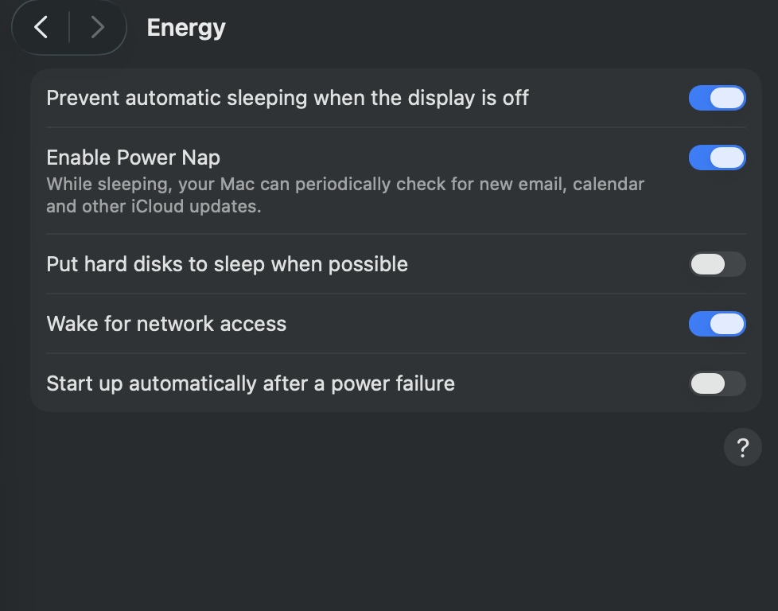

# rclone OneDrive on macOS (external drive)

Mount Microsoft OneDrive to folders on an external volume using **rclone** and **macFUSE**, instead of relying on Apple’s OneDrive client.

### What this setup is for

This workflow is aimed at **day-to-day use with large files**—especially **video and audio** (masters, project media, long recordings, music libraries)—where you want OneDrive to show up as **normal folders on an external disk** you can open in **Finder**, **Preview**, **Quick Look**, or **creative apps**, without filling your **internal SSD** with cache and placeholders. It is **not** primarily a “developer stack” tutorial: you do **not** need to be syncing **code repositories** or running **builds** on these mounts for the approach to make sense.

You can still use the same pattern for other big binaries (disk images, archives, datasets). Sections below mention **Docker** and **IDEs** only because those combinations are where **misunderstandings about mounts and disks** often turn into lost work—not because this repo assumes you are coding on the mount.

### A personal note (why this repo exists)

I put this together for my own **day-to-day work with large video and audio** on a Mac, using OneDrive as the backing store but wanting the files to feel like a **normal external disk**—not a sync client that quietly **eats the internal SSD** or behaves oddly under **heavy browsing and big transfers**. Along the way I ran into real friction: **APFS** on that portable drive collided with **permissions and tooling** (including containers), and I learned the hard way how easy it is to **misread where data actually lives** when cloud mounts, Docker, and Finder are all in the mix.

**Rclone on the host**, with **explicit cache limits on the external volume** and a **strict unmount-before-eject habit**, finally matched how I think about “this folder is my drive.” I scrubbed anything specific to my own folders or employer, kept the scripts generic, and published it so anyone facing the same Mac + OneDrive + big files headache has a **straight path** without retracing every dead end I hit.

## Why rclone instead of the official OneDrive app (especially on Mac)?

The official **OneDrive** client on macOS is built for typical “sync my files” use. It integrates through Apple’s **File Provider** stack. That works well for many people, but it creates recurring pain when you work with **very large files on an external volume** (and for some heavy technical workflows: huge folder trees, containers, build tools).

### What goes wrong with the official app on macOS

1. **Internal disk pressure (“Files On-Demand” and local cache)**  
   Even when you *intend* everything to live on an external drive, the client still leans on the **internal SSD**: metadata, placeholders, and downloaded chunks often land under locations such as `~/Library/CloudStorage`. Under load, that can **fill the system volume** while you still think “my data is on the USB disk.” When the internal disk is full, apps fail to save, sync stalls, and you can end up with **incomplete local copies** or **failed operations** that feel like data problems.

2. **Opaque behavior for heavy file access**  
   File Provider–backed folders can be **slower or less predictable** when you browse big trees, scrub timelines, or let apps **watch** folders. That matters for **video/audio pipelines** and asset libraries as much as for code. Rclone exposes OneDrive as a **normal path** you control, with explicit **VFS cache limits** on the volume you choose (here, your external disk), so large reads/writes are easier to reason about than an invisible cache on the system drive.

3. **You choose where the cache lives and how big it is**  
   With `rclone mount` you set **`--vfs-cache-max-size`** (and related flags) so growth is bounded on **your** drive, not an invisible expansion on the internal SSD.

### How people accidentally get hurt (including “data loss” stories)

These are not theoretical edge cases; they show up in real setups:

| Situation | What actually happens |
|-----------|-------------------------|
| **Force-ejecting an external drive** while a cloud filesystem is still mounted | macOS may **force-close** FUSE mounts. You risk **I/O errors**, **corrupted partial writes**, and **ghost processes** still pointing at paths that no longer exist. The cloud copy may still be fine, but **local work in flight** can be damaged or confusing to recover. |
| **Running `rclone mount` only inside Docker Desktop for Mac** and mapping a folder from an external disk into the container | Docker runs in a **Linux VM**. A FUSE mount performed *inside* the container typically lives in that VM’s view of the world. The “files” you see in the container are **not reliably the same as what macOS Finder shows on the physical disk**. People assume “it’s on my external drive,” unplug or eject, and then discover **nothing they expected was persisted on the USB volume**—or they mix up **cloud vs local vs VM**. That mismatch is often described as **data loss**, even when the root cause is **where the bytes were actually written**. |
| **Internal SSD full** because of OneDrive cache | Saves and sync operations fail (including **large media exports** or copies to the “external” location); you may lose time or end up with **incomplete local files** if you do not notice the disk is full. |

**Rclone on the Mac host** (this repo’s approach) addresses the intent: **Finder and your apps see the same mount**, cache limits can target **external storage**, and the provided **`unmount_onedrive.sh`** workflow is meant to **tear down mounts before eject**, reducing the “force eject / corrupt / zombie mount” class of failures.

This is **not** a claim that Microsoft’s client loses cloud data in normal use. It *is* an explanation of why **people who live in large media files on Mac** (and other power users) often prefer rclone: **predictable paths**, **bounded cache on the disk you choose**, and **fewer surprises** when combining OneDrive with **external drives**—including when you also use **developer tools** or **Docker** elsewhere in your workflow.

## Prerequisites

- macOS with administrator access (for macFUSE approval in System Settings)
- An external disk formatted with a macOS-friendly filesystem (commonly **exFAT** for portability and large files)
- A Microsoft account with OneDrive

## 1. Install dependencies

Install in this order.

### Homebrew

If you do not have [Homebrew](https://brew.sh/):

```bash
/bin/bash -c "$(curl -fsSL https://raw.githubusercontent.com/Homebrew/install/HEAD/install.sh)"
```

### macFUSE

macFUSE provides the kernel interface rclone needs for `rclone mount`:

```bash
brew install --cask macfuse
```

After installation, open **System Settings → Privacy & Security** and approve the macFUSE system extension if macOS prompts you. A restart may be required.

### rclone

```bash
brew install rclone
```

Confirm:

```bash
rclone version
```

## 2. Configure the OneDrive remote

Create or update the remote interactively:

```bash
rclone config
```

Typical choices:

1. **New remote** → pick a short name (this repo’s example uses `onedrive`).
2. **Storage** → **Microsoft OneDrive** (or **Microsoft OneDrive for Business** if you use work/school).
3. Complete the browser **OAuth** sign-in when rclone asks.

List top-level folders to see exact path names (including spaces):

```bash
rclone lsd onedrive:
```

(Replace `onedrive` if you chose a different remote name.)

## 3. Install these scripts

Clone or copy this repository to a folder on your Mac, for example:

```bash
git clone <your-repo-url>
cd rclone-onedrive-setup
```

Make the scripts executable:

```bash
chmod +x mount_onedrive.sh unmount_onedrive.sh
```

## 4. Create your `config.sh`

The mount script reads **`config.sh`** (not committed to git). Copy the example and edit it:

```bash
cp config.example.sh config.sh
```

Edit `config.sh` so that:

- **`REMOTE_NAME`** matches the name you used in `rclone config`.
- **`REMOTE_PATHS`** lists folders **on OneDrive** (as returned by `rclone lsd`).
- **`LOCAL_NAMES`** lists the folder names you want under `/Volumes/<YourDrive>/OneDrive/` on the external disk.
- **`CACHE_MAX_SIZE`** sets a per-mount VFS cache limit (for example `50G`).

All four arrays must have the **same number** of entries. You can use one folder or many.

## 5. Mount

1. Plug in the external drive and note its volume name in Finder (for example `MyPassport`).
2. Run:

```bash
./mount_onedrive.sh MyPassport
```

Use the **exact** volume name as shown under `/Volumes/`.

Mounted paths will be:

```text
/Volumes/<DriveName>/OneDrive/<LOCAL_NAMES entries>
```

### Finder sidebar favorites (drag to the sidebar)

You can **drag a mounted folder** (for example `.../OneDrive/Documents`) into the **Finder sidebar** under **Favorites**. That creates a **shortcut** to the path—usually a **bookmark**—not a second copy of your data and **not** a change to how **rclone** or **FUSE** work.

- **Mounting still comes from `mount_onedrive.sh`.** The sidebar entry does **not** keep the cloud mount alive by itself.
- **When the disk is ejected or mounts are down**, the favorite may **gray out**, break, or open nothing useful until you plug in, run **`mount_onedrive.sh`** again, and the **same path** exists. If the volume ever appears under a **different name** in `/Volumes/`, an old favorite still points at the **old path**—update or recreate it.
- **No extra sync layer:** it is convenience only; the same **safe eject** rules in [§6](#6-unmount-and-eject-safely) apply.
- **Easier to leave files open:** a sidebar shortcut makes it quicker to jump back into those folders—before eject, still **quit apps** and **close documents** that use the mount (including anything opened via that favorite).

## 6. Unmount and eject safely

`rclone mount` uses **FUSE** (via macFUSE). While mounts are active, the kernel and the `rclone` processes **hold open** paths under your external volume. Unplugging or **forcing** an eject in that state is how you get **I/O errors**, **partial writes**, **ghost `rclone` processes**, and **local** corruption or confusion—even when **OneDrive in the cloud** is still fine.

**Do not treat this like a normal USB stick.** Always tear down **rclone** and **FUSE** first, then eject.

### Recommended workflow (checklist)

1. **Quit or close files** that are using anything under `/Volumes/<YourDrive>/OneDrive/` (editors, media apps, terminals with `cd` into those paths, and files opened from a **Finder sidebar** favorite that points there).
2. Run **`unmount_onedrive.sh`** with your volume name (same name you used for `mount_onedrive.sh`):

   ```bash
   ./unmount_onedrive.sh MyPassport
   ```

3. Wait until the script finishes. On success it has already run **`diskutil eject`**—you do **not** need a separate Finder eject, and you can **unplug** once you see the success message.
4. If the script reports **eject failed**, do **not** yank the cable. See [Troubleshooting](#troubleshooting) and fix stuck mounts before trying again.

### What `unmount_onedrive.sh` does

In order: **`umount`** on each direct subfolder under `.../OneDrive/` (your configured mount points), a short wait, **`pkill`** only for `rclone mount` processes whose command line references **`/Volumes/<YourDrive>/OneDrive`** (other `rclone` jobs on the Mac are left alone), another wait, a second **`umount`** pass, then **`diskutil eject /Volumes/<YourDrive>`**.

### Finder eject: what to avoid

- **Do not rely on Finder’s eject icon first** while `rclone` is still running. Finder may say the disk is **in use**—that is expected. The fix is to **run `unmount_onedrive.sh`**, not to fight Finder.
- **Do not click “Force Eject”** to bypass the warning while cloud mounts are still active. That path **forces** FUSE teardown and is exactly the class of abrupt disconnect that risks **corrupted partial writes** and **unhappy apps**.
- After **`unmount_onedrive.sh`** succeeds, the volume should already be **ejected**. If it still appears in Finder, run the script again or check Activity Monitor for stray **`rclone`** before doing anything drastic.

### What not to do (quick reference)

| Avoid | Why |
|--------|-----|
| Unplugging the drive while mounts are up | Same as pulling a disk during active I/O; FUSE and apps can leave **partial** or **inconsistent** local state. |
| **Force Eject** in Finder while `rclone mount` is running | Forces disconnect; high risk of **I/O errors** and **local** damage to in-flight work. |
| Putting the Mac to **sleep** mid–large copy **to or from** the mount | Wake/suspend timing can interrupt transfers; verify copies and prefer finishing work before sleep. |
| Assuming “cloud still has it” means **local** cache is safe | The **remote** copy may be fine; **local** VFS cache and open handles can still be torn down badly if you disconnect wrong. |

## macOS Energy settings and your mounts (optional)

Large **video/audio** workflows and **`rclone mount`** both care about **sleep**, **idle power**, and whether **external storage** stays responsive. None of this replaces **`unmount_onedrive.sh`** before unplugging; it only reduces **surprise sleep** and **disk power management** getting in the way of long jobs.

**System Settings** location varies by macOS version and hardware (for example **Energy**, **Battery**, or **Lock Screen**). Not every Mac shows every toggle below.

Example configuration (your labels may differ slightly):



### What each option tends to mean for this setup

| Setting | If **on** | If **off** | Relevance to `rclone` + external drive |
|--------|-----------|------------|----------------------------------------|
| **Prevent automatic sleeping when the display is off** | The Mac is **less likely to enter full system sleep** when only the display sleeps. | The system may **sleep sooner** while you are away from the desk. | **On** reduces the chance that a **long copy or transcode to/from the mount** is interrupted because the whole Mac went to sleep. **Tradeoff:** higher energy use when the display is off. |
| **Enable Power Nap** | During sleep, the Mac can **wake briefly** for mail, calendar, and some **iCloud** updates. | No those short wake cycles for that background work. | Usually **orthogonal** to rclone mounts; occasional brief wakes generally do **not** replace normal sleep behavior for heavy I/O. Some people prefer it **off** when chasing the simplest possible sleep profile—personal preference. |
| **Put hard disks to sleep when possible** | macOS may **idle or spin down** attached disks when it thinks they are unused. | Disks are **kept ready** more of the time (especially relevant for **spinning** external HDDs). | **Off** is a common choice when an **external volume holds your FUSE mounts** and you want to avoid **idle spin-down** coinciding with **laggy first access**, timeouts, or “disk woke up” surprises during long sessions. **SSDs / NVMe enclosures** are less affected by “spin down” than HDDs, but **USB bridges** and power management still vary—this toggle is worth trying if you see **idle-related hiccups**. **Tradeoff:** slightly higher power use (and HDD noise) on some setups. |
| **Wake for network access** | The Mac can **wake from sleep** for incoming network requests (for example **Screen Sharing**, **File Sharing**). | It stays asleep until you use it locally (unless something else wakes it). | Matters if other devices **wake this Mac** and expect **shared folders**—possibly including paths on your **external** volume. If nothing in your workflow needs **wake-on-LAN–style** behavior, either state is usually fine. |
| **Start up automatically after a power failure** | After utility power returns, the Mac **turns itself on**. | The Mac **stays off** until you press power. | After any boot, **`rclone mount` is gone** until you run **`mount_onedrive.sh`** again ([§ After a Mac restart](#after-a-mac-restart)). **Auto-start** after an outage can mean the machine comes up **before** peripherals or external disks finish their own power-on sequence—plan to **verify the drive is mounted in Finder** and **remount** as needed. |

### Practical takeaway

- For **overnight or unattended** work touching **`/Volumes/.../OneDrive/...`**, favor settings that **avoid full system sleep** during that window (often **“Prevent automatic sleeping when the display is off” = on** for desktops on AC power) and consider **“Put hard disks to sleep when possible” = off** if you use **HDDs** or see **idle disk** issues.
- For **laptops on battery**, the same toggles **cost battery life**—use them when plugged in or only while running critical transfers.

## After a Mac restart

This section also applies after a **full shutdown** or **power off**. A **restart is not the same as sleep:** sleep usually keeps your session and running apps (including **`rclone mount`** if you left it up). A **full restart or shutdown** tears down all user processes.

### What is gone after boot

- Every **`rclone mount`** process started earlier is **stopped**. macFUSE **FUSE mounts** under `/Volumes/<YourDrive>/OneDrive/...` are **no longer active** as cloud-backed mounts.
- **Finder sidebar favorites** and any open windows that pointed at those paths will be **broken or empty** until you **mount again** (see below).
- Your **OneDrive content in the cloud** is unchanged. **`rclone`** remote configuration and tokens normally remain in **`~/.config/rclone/`** (unless you removed them).

### What you do next

1. **Connect the external drive** (if it was unplugged).
2. Run **`mount_onedrive.sh`** again with the correct volume name:

   ```bash
   ./mount_onedrive.sh MyPassport
   ```

3. Your **`config.sh`** and scripts on disk are still there; you are only **restarting the mounts**.

If the Mac **restarted while the drive was still connected**, macOS typically **unmounts volumes** during shutdown. You still need to run **`mount_onedrive.sh`** after login—nothing in this repo **auto-mounts** unless you add a **LaunchAgent** (next section). If you **had not** run **`unmount_onedrive.sh`** before a forced restart or crash, treat it like any abrupt disconnect: check for **stuck `rclone`** (unlikely after a clean boot), then remount; any **in-flight local cache** may have been cut off, while **remote** files on OneDrive are usually fine.

### Optional automation

To run **`mount_onedrive.sh`** automatically at login, see [Optional: run mounts at login (LaunchAgent)](#optional-run-mounts-at-login-launchagent). The disk must be **plugged in** (or the script will exit with “drive not found”); check the log paths in the plist if it does not mount on first try.

## Optional: run mounts at login (LaunchAgent)

To run the mount script when you log in (after the external disk is connected), install a **LaunchAgent** that calls the script with your volume name.

1. Replace placeholders in the plist below: your macOS username, full path to `mount_onedrive.sh`, and your volume name.
2. Save as `~/Library/LaunchAgents/com.example.rclone-onedrive.plist` (use a unique label; reverse-DNS style is typical).
3. Load it:

```bash
launchctl load ~/Library/LaunchAgents/com.example.rclone-onedrive.plist
```

Example plist (edit all `CHANGE_ME` values):

```xml
<?xml version="1.0" encoding="UTF-8"?>
<!DOCTYPE plist PUBLIC "-//Apple//DTD PLIST 1.0//EN" "http://www.apple.com/DTDs/PropertyList-1.0.dtd">
<plist version="1.0">
<dict>
    <key>Label</key>
    <string>com.example.rclone-onedrive</string>
    <key>ProgramArguments</key>
    <array>
        <string>/CHANGE_ME/full/path/to/mount_onedrive.sh</string>
        <string>CHANGE_ME_VolumeName</string>
    </array>
    <key>RunAtLoad</key>
    <true/>
    <key>StandardOutPath</key>
    <string>/tmp/rclone-onedrive-mount.log</string>
    <key>StandardErrorPath</key>
    <string>/tmp/rclone-onedrive-mount.err</string>
</dict>
</plist>
```

**Note:** If the external disk is not connected at login, the script exits with an error until the disk is present; you can run `./mount_onedrive.sh` manually when you plug it in.

## Troubleshooting

| Issue | What to try |
|--------|-------------|
| Finder says the disk **can’t be ejected** / **in use** | Run **`unmount_onedrive.sh`** first ([§6](#6-unmount-and-eject-safely)). Do **not** use **Force Eject** while `rclone` is still mounting that drive. |
| **Sidebar favorite** to a mount is gray or “can’t be opened” | Expected when the drive is **ejected** or **`mount_onedrive.sh`** has not been run. Remount with the script; if the **volume name** changed, remove the old favorite and drag the folder again. |
| After **restart / shutdown**, cloud folders are “gone” in Finder | Normal: **`rclone mount` does not survive reboot.** Plug in the drive and run **`mount_onedrive.sh`** again ([§ After a Mac restart](#after-a-mac-restart)). Use a **LaunchAgent** if you want login automation. |
| Mount fails: directory not empty | The scripts use `--allow-non-empty`. If it still fails, remove stray files in the mount folder (except do not delete data you care about). |
| I/O or “stuck” mount after unplugging | Follow [§6](#6-unmount-and-eject-safely) next time. In a bad state: `umount` the paths under `.../OneDrive/` or stop the matching `rclone` processes, then try again. |
| OneDrive auth expired | `rclone config reconnect onedrive:` (adjust remote name if needed). |
| macFUSE / security prompts | Re-check **Privacy & Security** and macFUSE documentation for your macOS version. |

## Why exFAT for the external drive (and APFS pain points in this setup)

This project assumes the OneDrive mount tree lives on a **removable** disk you may use with **more than one OS**, or alongside **Docker** and other tools. In that situation **APFS on the external drive** caused concrete problems; **exFAT** avoided them.

### Specific issues with APFS here

1. **macOS permissions vs containers**  
   APFS carries **full macOS ownership and ACL semantics** on every file. When the same volume is accessed from the **host** and from **software that does not see the world like Finder** (for example **Docker Desktop**, where file access is bridged through a Linux VM), you often hit **“Operation not permitted” / “Permission denied”** for paths that look fine in Finder. The UID/GID and ignore-ownership toggles become a debugging loop instead of transparent access.

2. **Mental model: “this disk is my portable workspace”**  
   With APFS, the external disk behaves like **another Mac home folder**, not like a **neutral data slab**. Tools that expect simple, portable paths (sync scripts, bind mounts, CI-style layouts) keep running into **permission edges** that exFAT simply does not have in the same form.

3. **Portability**  
   **APFS** is Apple-first. **Windows** does not mount APFS out of the box; **Linux** support exists but is not something you want to rely on for a drive you move between machines. **exFAT** is boring and universally readable/writable, which matches “external OneDrive bridge I plug into different computers.”

4. **Performance trade-off**  
   **APFS** on a good external SSD is often **faster** on a Mac-only, single-user setup. **exFAT** is usually **slower** and **less crash-resilient** than APFS. This README still recommends exFAT for this **workflow** because **predictable access and portability** mattered more than squeezing the last bit of APFS performance.

### Terabyte-scale copies: fast externals (e.g. NVMe) ↔ SD cards

Moving **1–2 TB** (or more) between a **fast USB/NVMe-class enclosure** and an **SD card** is **much harder than it sounds**, even when Finder reports “copying…”

- **The SD card is the bottleneck.** Peak megabytes-per-second numbers on the box are often **burst** ratings. **Sustained writes**—what a huge copy actually uses—can **collapse** after a short time (heat, card quality, controller throttling). A transfer that “should” take an hour on paper can turn into **many hours** or span **overnight**.
- **Lots of small files** (audio projects, image sequences, unpacked archives) amplify the pain: **metadata and seek overhead** dominates, and progress is uneven.
- **Sleep, cables, hubs, and accidental eject** during a multi-hour job are realistic failure modes. If you **delete the source** before you **verify the destination**, you have classic **self-inflicted data loss**—the filesystem did not “eat” your files; the copy never truly finished.
- **Capacity traps.** SD cards are a common target for **counterfeits** (reporting fake size). A 2 TB job to a bad card can **fail silently** or **overwrite earlier data** in ways you only notice later.

For huge moves, prefer **tools that can resume or verify** (`rsync`, `rclone copy`, dedicated backup utilities), **stable power**, and **checksum or spot-check verification** before you reclaim space on the source. This repo is about **OneDrive mounts**, not a full migration guide—but the same discipline applies when you are shuffling **local** terabytes between media types.

### Data-loss footguns with **APFS** and **Mac OS Extended (Journaled)** on removable media

**Journaling** (HFS+ “Mac OS Extended (Journaled)” or APFS’s own design) mainly helps the **filesystem stay consistent** after a crash or sudden unplug. It does **not** mean “my 1 TB copy is magically all-or-nothing.” If a copy is **interrupted**, you often get a **mix of complete files, partial files, and missing files** on the destination—while the volume still mounts cleanly. That is a frequent source of **“I lost data”** stories that are really **unverified or partial transfers**.

**APFS** on small removable media (especially **SD cards**) can be **finicky**: not every card/controller pairing is a good long-term fit for heavy writes, and **snapshots** (Time Machine–related or otherwise) can **surprise you with space usage** until you understand what is holding blocks. **Permissions and ACLs** still apply, so copies to or from **non-APFS** volumes can **silently drop metadata** you assumed traveled with the file.

**Mac OS Extended (Journaled)** is **legacy-first**: fine on Mac-centric spinning disks, but **poor for sharing** with current Windows/Linux without extra software, and it shares the same **“copy finished?”** ambiguity as APFS for huge jobs.

**exFAT** is not a magic shield—**yank the card mid-write** and you can still corrupt the filesystem—but for **cross-device shuffling of large media** it avoids **Mac-only permission baggage** and **cross-OS surprises**, which is why this project keeps recommending it for the **OneDrive bridge drive** even though APFS is technically “nicer” on paper for a single Mac.

### Summary

**exFAT**: large files (unlike FAT32), works on **Windows, macOS, and Linux** without extra drivers, and **avoids the APFS permission friction** that showed up when combining **host mounts, rclone, and Docker-style tooling** on the same external volume.

If your drive is **Mac-only**, **not** shared with other OSes, and **not** bound into containers, **APFS** can be a better technical fit—at the cost of the issues above when you step outside that box.

## License

Add a `LICENSE` file if you publish this repository (for example MIT), so others know how they may use it.
